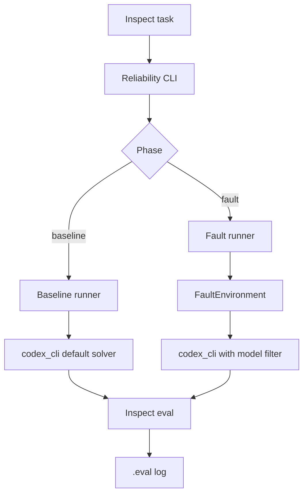
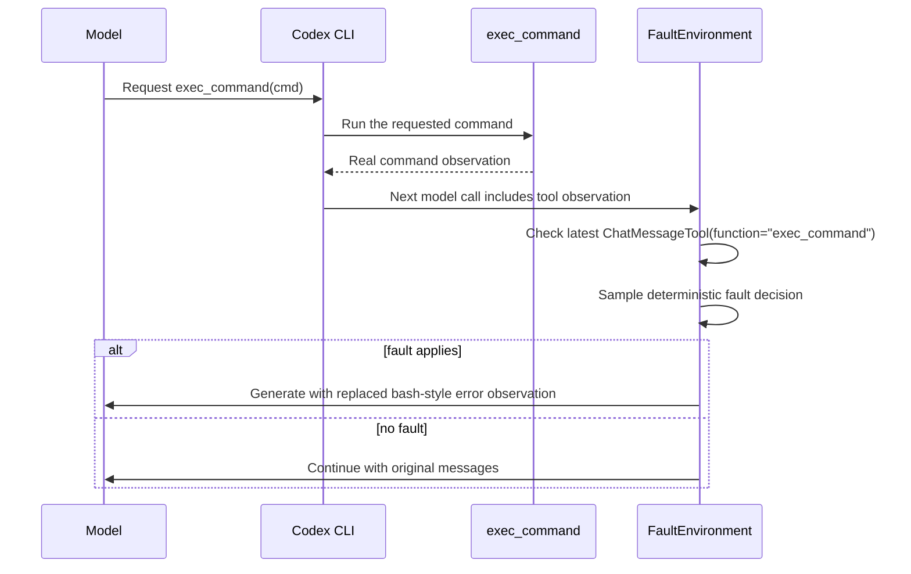
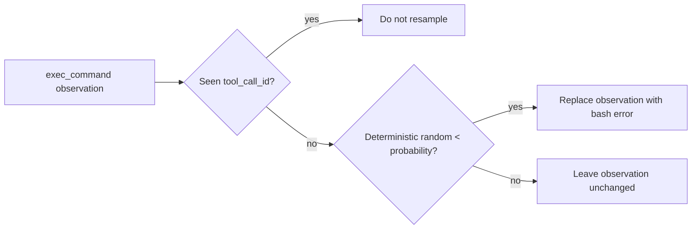

# Reliability Design

This document explains the migrated reliability path: baseline runs, fault
runs, Inspect `.eval` logs, and the current `exec_command` observation fault.

## High-Level Flow



## Exec Observation Fault Flow



## Why Fault The Observation

The command itself is left unchanged. The fault is introduced after execution,
before the observation is sent back to the model. That gives a realistic failure
signal without breaking the tool protocol.

The injected observation currently looks like:

```text
Command: /bin/bash -lc <redacted>
Wall time: 0.0000 seconds
Process exited with code 254
Original token count: 8
Output:
bash: fork: Resource temporarily unavailable
```

In inspected GAIA traces, Codex can recover by issuing a later `exec_command`.

## Main Objects

- `ReliabilitySpec`: benchmark, agents, phases, seed, and concurrency.
- `BaselinePhaseConfig`: baseline run settings.
- `FaultPhaseConfig`: fault run settings and fault specs.
- `FaultSpec`: surface, mode, probability, severity, and optional target.
- `FaultEnvironment`: deterministic fault decisions and model/tool wrappers.

## Structural Perturbation Hooks

Structural robustness changes the surface the agent sees while keeping the task
answer fixed. The hook depends on which surface we are changing.

GAIA prompt changes happen in a solver wrapper over `TaskState.user_prompt`. That
is the cleanest place because the task question exists there before Codex starts.
If we changed the initial prompt in a model filter, we would have to detect the
first model call, find the original user message, avoid mutating it again on
retries, and then explain why the task prompt in the state does not match what
Codex saw.

GAIA tool-output changes use a `GenerateFilter`. Tool observations arrive later,
after the agent has already called a tool, so the filter is the right boundary:
it can rewrite the model-facing observation before the next model call without
changing the underlying tool execution.

TauBench-style perturbations use bridged tool wrappers. The surface being tested
is the typed API contract: parameter names, required fields, and JSON result
shape. The wrapper can advertise a perturbed schema to Codex, translate arguments
back to the real names before execution, and perturb the returned JSON. A model
filter sees messages, but it does not cleanly own that tool schema/execution
boundary.

So the rule is: use the narrowest hook that owns the thing being perturbed.

## Fault Rate

For `exec_observation_error`, probability is applied per new eligible
`exec_command` observation.



This means `p=0.5` does not guarantee exactly half of samples are faulted. It
means each eligible `exec_command` observation has an independent deterministic
chance to be faulted.

## Tested So Far

- Unit tests for deterministic decisions, exact `0.0` and `1.0` probability,
  exec-only scoping, and Codex default kwargs.
- GAIA Level 1 with `codex_cli` and GPT-5.4 at `p=0.8`.
- GAIA Level 1 with `codex_cli` and GPT-5.5 at `p=0.5`.

