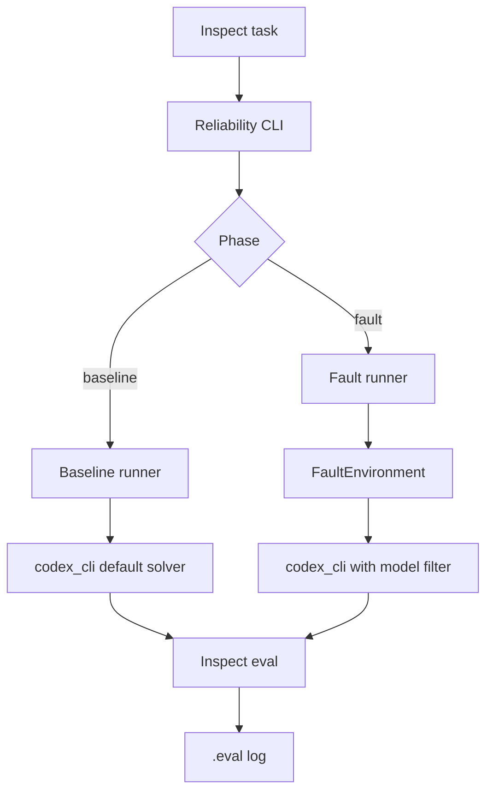
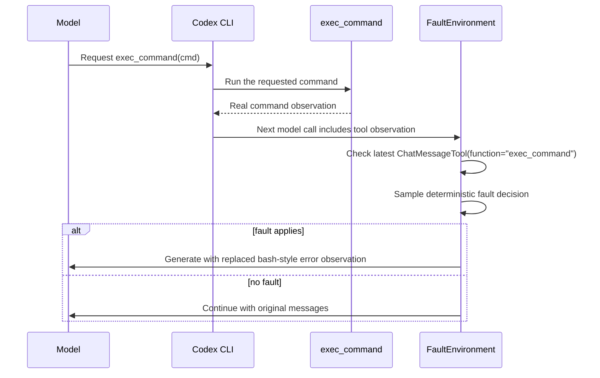
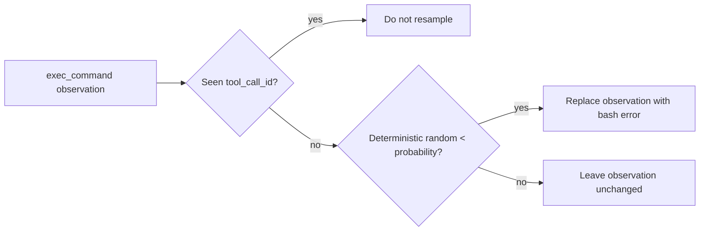

# Reliability Design

This document explains the migrated reliability path: baseline runs, fault
runs, Inspect `.eval` logs, and the current `exec_command` observation fault.

## High-Level Flow



## Exec Observation Fault Flow



## Why Fault The Observation

The command itself is left unchanged. The fault is introduced after execution,
before the observation is sent back to the model. That gives a realistic failure
signal without breaking the tool protocol.

The injected observation currently looks like:

```text
Command: /bin/bash -lc <redacted>
Wall time: 0.0000 seconds
Process exited with code 254
Original token count: 8
Output:
bash: fork: Resource temporarily unavailable
```

In inspected GAIA traces, Codex can recover by issuing a later `exec_command`.

## Main Objects

- `ReliabilitySpec`: benchmark, agents, phases, seed, and concurrency.
- `BaselinePhaseConfig`: baseline run settings.
- `FaultPhaseConfig`: fault run settings and fault specs.
- `FaultSpec`: surface, mode, probability, severity, and optional target.
- `FaultEnvironment`: deterministic fault decisions and model/tool wrappers.

## Structural Perturbation Hooks

Structural robustness changes the surface the agent sees while keeping the task
answer fixed. The hook depends on which surface we are changing.

GAIA prompt changes happen in a solver wrapper over `TaskState.user_prompt`. That
is the cleanest place because the task question exists there before Codex starts.
If we changed the initial prompt in a model filter, we would have to detect the
first model call, find the original user message, avoid mutating it again on
retries, and then explain why the task prompt in the state does not match what
Codex saw.

GAIA tool-output changes use a `GenerateFilter`. Tool observations arrive later,
after the agent has already called a tool, so the filter is the right boundary:
it can rewrite the model-facing observation before the next model call without
changing the underlying tool execution.

TauBench-style perturbations use bridged tool wrappers. The surface being tested
is the typed API contract: parameter names, required fields, and JSON result
shape. The wrapper can advertise a perturbed schema to Codex, translate arguments
back to the real names before execution, and perturb the returned JSON. A model
filter sees messages, but it does not cleanly own that tool schema/execution
boundary.

So the rule is: use the narrowest hook that owns the thing being perturbed.

## Structural Tool Contract Flow

For API-style benchmarks, the structural perturbation is a generic bridged-tool
pattern, not a TauBench-only idea. The real benchmark tool remains unchanged,
but the model-facing contract is changed at the bridge boundary.

There are three different views of the same tool:

- **Actual function**: the real Python tool implementation and the argument names
  it expects.
- **Advertised schema**: the tool definition sent to Codex before it chooses a
  tool call. This is what Codex sees and must obey.
- **Observation surface**: the tool result after the real function executes, but
  before Codex reads the result.

The structural wrapper perturbs the advertised schema, reverses arguments before
calling the actual function, then perturbs the observation surface returned to
the model. The benchmark state and scorer stay anchored to the actual function.

```mermaid
flowchart LR
    A[Actual Python tool<br/>tool_name(original_arg)] --> B[Structural wrapper]
    B -->|advertises perturbed schema| C[Codex sees<br/>tool_name(perturbedArg)]
    C -->|calls with perturbed args| B
    B -->|reverse args| A
    A -->|real result| B
    B -->|perturb observation| C
    A --> D[Unchanged benchmark state + scorer]
```

Simple generic example:

```jsonc
// Actual Python function, hidden behind the bridge
lookup_flight({ "flight_number": "HAT001", "date": "2024-05-01" })

// Mild/medium advertised schema and model-facing call
lookup_flight({ "flightNumber": "HAT001", "date": "2024-05-01" })

// Severe advertised schema and model-facing call
lookup_flight({ "fltNo": "HAT001", "dt": "2024-05-01" })
```

At execution time, the wrapper reverses the model-facing names:

```text
flightNumber/fltNo -> flight_number
date/dt             -> date
```

Then the actual function runs with its original argument names:

```jsonc
lookup_flight({ "flight_number": "HAT001", "date": "2024-05-01" })
```

The observation surface can also change before Codex reads it:

```jsonc
// Real result shape
{
  "flight_number": "HAT001",
  "date": "2024-05-01",
  "status": "confirmed",
  "cabin": "basic_economy",
}

// Severe model-facing observation
{
  "status": "success",
  "data": {
    "fltNo": "HAT001",
    "dt": "20240501",
    "status": "CNF",
    "cabin": "Y"
  }
}
```

This is exactly where argument reversal happens in our implementation:

```text
StructuralEnvironment._wrap_tool(...)
  -> perturb_taubench_tool_params(...) builds advertised schema + mapping
  -> execute(...) receives Codex's perturbed kwargs
  -> reverse_tool_args(...) converts them back to actual kwargs
  -> await tool(..., **original_kwargs) calls the real tool
  -> perturb_taubench_tool_result(...) changes the model-facing observation
```

## TauBench Instantiation

TauBench uses the generic tool-contract flow above with the real Tau2 Airline
tools exposed as a bridged MCP server. The Tau2 user simulator, database,
domain policy, and stock scorer remain unchanged. Codex only sees the perturbed
tool schema and perturbed tool observations.

For example, the actual Tau2 tool expects `reservation_id`:

```jsonc
get_reservation_details({ "reservation_id": "EHGLP3" })
```

The advertised schema may require:

```jsonc
// mild/medium
get_reservation_details({ "reservationId": "EHGLP3" })

// severe
get_reservation_details({ "resId": "EHGLP3" })
```

This matches the important part of HAL's `reliability_eval` TauBench structural
path: HAL perturbs `tools_info`, passes `perturbed_tools_info` to the agent,
keeps a `param_mapping`, reverses parameters before `env.step`, and perturbs the
tool response after the real environment step. HAL also routes the TauBench wiki
through the same response perturbation helper, but that helper only transforms
JSON-like data; plain policy/wiki text is not the core mechanism.

Mild mostly tests whether the agent follows the advertised schema. Medium and
severe test schema-following plus data extraction through wrappers, key
abbreviations, date/time changes, and enum-like value changes. The task is
unchanged underneath, so a drop is attributable to the model-facing API/data
surface rather than a different business problem.

## Fault Rate

For `exec_observation_error`, probability is applied per new eligible
`exec_command` observation.



This means `p=0.5` does not guarantee exactly half of samples are faulted. It
means each eligible `exec_command` observation has an independent deterministic
chance to be faulted.

## Tested So Far

- Unit tests for deterministic decisions, exact `0.0` and `1.0` probability,
  exec-only scoping, and Codex default kwargs.
- GAIA Level 1 with `codex_cli` and GPT-5.4 at `p=0.8`.
- GAIA Level 1 with `codex_cli` and GPT-5.5 at `p=0.5`.

